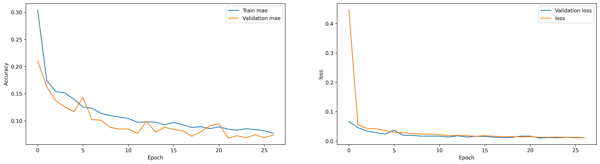
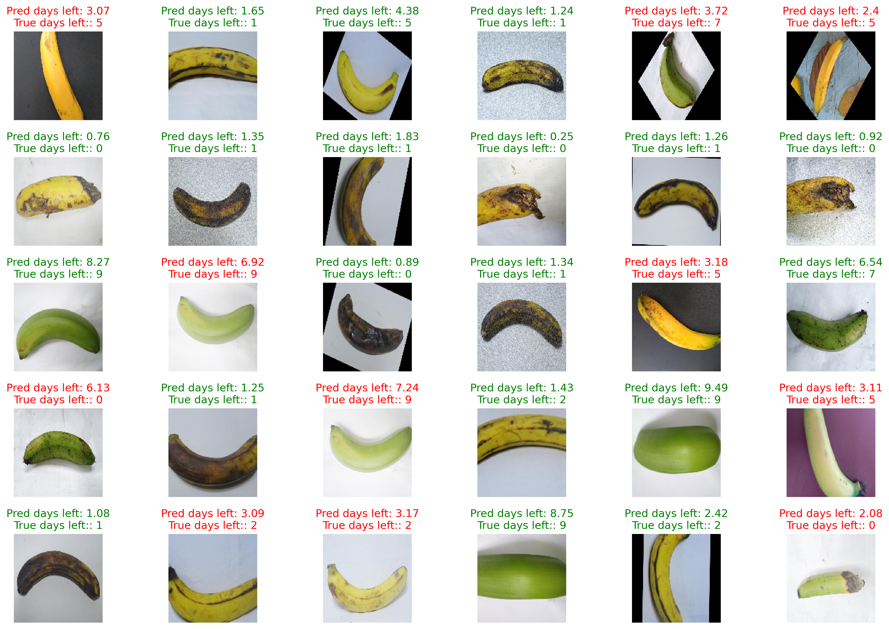

# 🍌 Banana Ripeness & Shelf-Life Predictor

A Deep Learning project that analyzes banana images and predicts **how
many days remain before the banana becomes overripe or should be
discarded**.

This project uses a **multi-head Convolutional Neural Network (CNN)**
trained on categorized banana images to determine ripeness stage and
estimate the remaining number of edible days.

## 🌟 Features

-   💾 **Saves training progress, weights, and biases**
-   👁️ **Visualizes intermediate training results**
-   🧠 **Multi-output CNN model**
-   📊 **Automatic dataset distribution plots**
---

## 📂 Dataset Categories & Interpretation

  ----------------------------------------------------------------------------------
  Category          Edible?       Days Until Spoilage              Notes
  ----------------- ------------- -------------------------------- -----------------
  **freshunripe**   ❌ Not        \~5 days to ripeness / 9 to      Very green, hard
                    recommended   spoilage                         

  **unripe**        ❌ Safe but   \~3 days to ripeness / 7 to      Greenish-yellow
                    not tasty     spoilage                         

  **freshripe**     ✅ Best taste 1--5 days                        Fully yellow

  **ripe**          ✅ Good       0--2 days                        Small brown dots

  **overripe**      ⚠️ Edible     0--1 days                        Very soft,
                    with caution                                   spotted

  **rotten**        ❌ Not edible 0 days                           Mold, smell,
                                                                   black areas
  ----------------------------------------------------------------------------------

---
## 🧠 Model Architecture

    Conv2D: 32 (4x4)
    Conv2D: 64 (4x4)
    Conv2D: 128 (4x4)
    Conv2D: 128 (4x4)
    Dense: 512 neurons
    Dense: 4 hidden layers
    Output: multi-head

---

Update *settings.py* with paths and hyperparameters.

## 📁 Folder Structure

    project/
    │-- utils/
    │-- docs/
    │   ├── data_train.png
    │   └── results_example.png
    │-- settings.py
    │-- train.py
    │-- README.md

---
## 📊 Training Results

### Training Curve

---
### Example Prediction Results

---
## 📈 Future Improvements

-   Add confusion matrix
-   Improve augmentation
-   API real-time prediction
-   Convert to ONNX/TFLite
-   Mobile-friendly model

---
## 📜 License
MIT License

---
## 🧑‍💻 Author

**Denys**  
Passionate about AI and computer vision.
Reach me at: [denys.zakharov.work@gmail.com]

---
